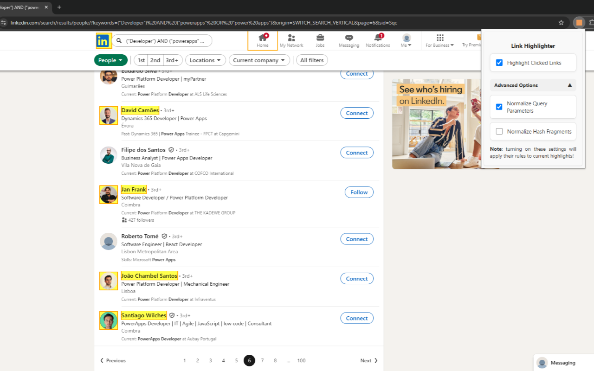
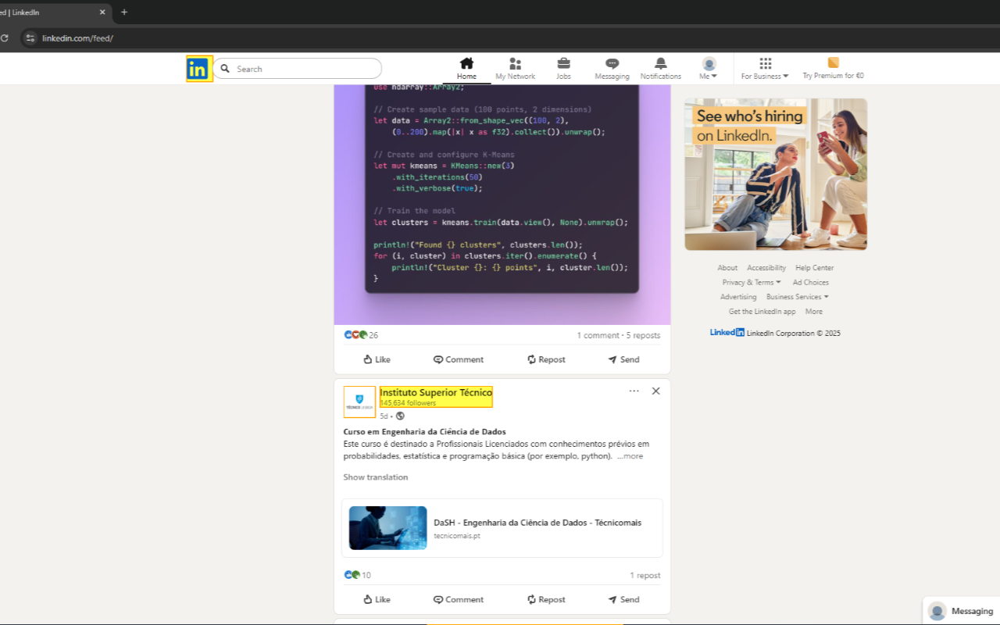
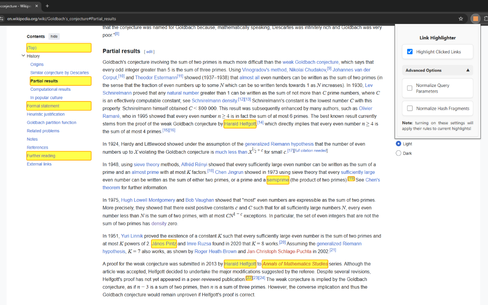
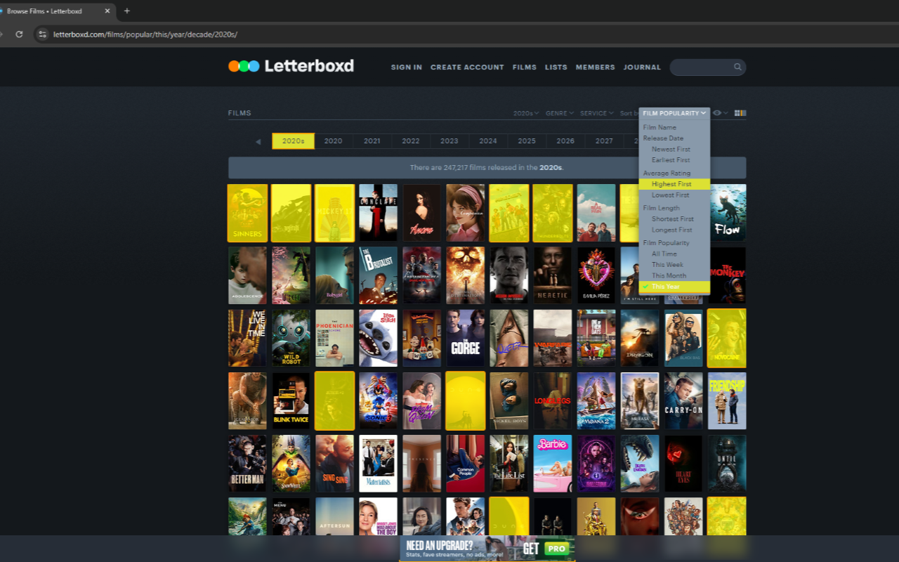

# Link Highlighter

A simple browser extension that highlights all links opened on any tab while the extension was toggled on. Geared towards recruiters, researchers, or anyone wanting to keep track of which links they've opened.

#### Available on [Firefox](https://addons.mozilla.org/en-US/firefox/addon/url-highlighter/) and [Chrome](https://chromewebstore.google.com/detail/link-highlighter/hbdaiciogdfmibiekklhllpbldhodbil?authuser=0&hl=en-GB).

---

### Use cases

- A recruiter browsing candidate profiles on LinkedIn can instantly see which profiles they’ve already reviewed.

- A researcher can stay oriented in long-form content, seeing at a glance which pages, or even which sections, they’ve already explored.

- Or any situation where someone might want to keep track of which links they've visited (e.g. movies on Letterboxd, links on Google Search, etc.)

### Advanced Options

By default, this extension normalizes all URLs by removing all query parameters and hash fragments. **This leads to ideal results on LinkedIn**.

However, normalizing URLs may lead to results that aren't ideal on other websites. For this reason, URL normalization is customizable under "**Advanced Options**" on the popup:

- **Normalize Query Parameters**  
  Strips everything after `?` → treats URLs that differ by query parameters as the same.
  - **Example**: ``https://github.com/TiDeane?tab=repositories`` → becomes ``https://github.com/TiDeane``.
  - **Use case**: Github uses ``?`` to divide tabs on a user's profile, so if you want to track which tabs you've visited, turn off query parameter normalization.

- **Normalize Hash Fragments**  
  Strips everything after `#` → treats section-anchor links as one page.
  - **Example**: ``https://en.wikipedia.org/wiki/JavaScript#Syntax`` → becomes ``https://en.wikipedia.org/wiki/JavaScript``.
  - **Use case**: Wikipedia uses ``#`` to jump to specific sections, so if you want to track which sections you’ve visited, turn off hash fragment normalization so each section link remains distinct.

## Example Images

